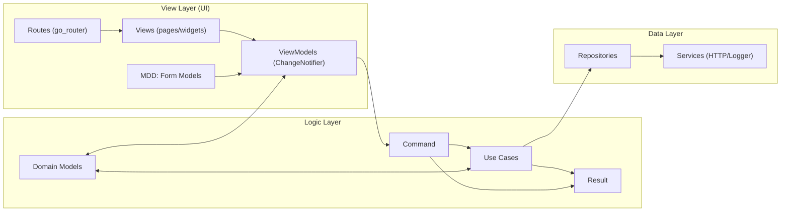

# Notes App (Flutter)

App de notas para praticar **MVVM** com separação em camadas e padrões simples para fluxo assíncrono (**Command**/**Result**).

## Arquitetura (MVVM + camadas)

- **View (UI)**: telas + navegação (`go_router`) + ViewModels (`ChangeNotifier`).
- **Lógica**: Use Cases + modelos do domínio + regras/validações.
- **Dados**: repositórios + serviços (HTTP/Logger).



## Padrões em destaque

### MDD (Model-Driven Development)

Modelos guiam a UI e validações:

- **Form Models** (ex.: `NoteFormModel`) guardam estado do formulário e funções de `onSaved/validator`.
- **Domain Models** (ex.: `Note.create`) validam e geram entidades válidas.

### Command

`Command0/Command1` encapsulam ações assíncronas no ViewModel e expõem estado:

- `running` para loading
- `error` / `completed` para feedback

A View escuta o command com `ListenableBuilder`.

### Result

`Result<T>` padroniza retorno de sucesso/erro (ex.: `Ok<T>` e `Error<T>`), permitindo `switch` explícito sem exceptions como fluxo principal.

## Estrutura (onde fica cada coisa)

```text
lib/
  ui/           # View: views/, view_models/, models/ (form)
  routes/       # go_router
  domains/      # Lógica: models/, use_cases/, repositories/
  services/     # Dados: Dio/Logger + contracts
  shared/       # Result, Command, validators, helpers
```

## Como rodar

```bash
flutter pub get
flutter run
```

## Stack

- Flutter (Material 3)
- provider, go_router, dio, logger
